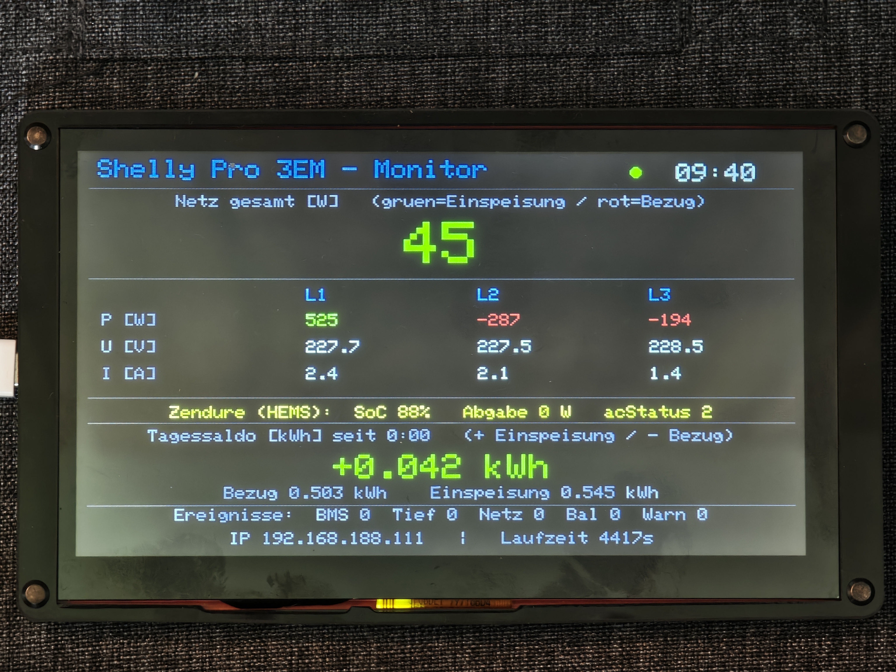

# ESP32 — Shelly Pro 3EM + Zendure SolarFlow Monitor & Watchdog

> Budget ESP32-S3 port of
> [gigar1-shelly-zendure-monitor](https://github.com/ReinhardJesolowitz24/gigar1-shelly-zendure-monitor)
> — same features, ~1/3 the cost. **Tested on hardware: 24 h+ stable** over a full
> day/night cycle with the **LovyanGFX** display driver.

An **independent**, cloud-free monitor and safety watchdog for a home battery setup,
running on an **ESP32-S3** with an 800×480 display. It reads a **Shelly Pro 3EM** (grid
meter) and a **Zendure SolarFlow** battery **read-only** over their local HTTP APIs,
shows live data and a daily energy balance, raises a visible alarm on misbehaviour, and
serves its own JSON API.

*Live dashboard on the ELECROW 7″ panel: grid total, per-phase L1/L2/L3, Zendure SoC/output, daily energy balance.*

This is the cheaper sibling of the Arduino GIGA R1 version — same features, ~1/3 the cost.

## Hardware

- **ELECROW 7″ HMI ESP32 Display, 800×480 RGB TFT** — ESP32-S3-WROOM-1, 8MB PSRAM,
  RGB parallel panel (driver EK9716BD3), GT911 capacitive touch. ELECROW sells the
  same board under two names over time: "ESP32 Display / Wizee" and "CrowPanel ESP32
  HMI 7.0". (The titles say "ESP32 / LX6" but it is an ESP32-**S3**.)
  - 800×480 — **same resolution as the GIGA display**, so the layout carries over 1:1
- Shelly Pro 3EM (3-phase grid meter, on the LAN)
- Zendure SolarFlow (e.g. 2400 / 2400 Pro, on the LAN via WiFi)
- **Power:** ~450 mA @ 5 V (**~2.25 W**) in operation — any USB port or a small 5 V
  charger (≥ 500 mA, 2.5–10 W) is plenty. **No 20 W+ charger needed.**

## Libraries

- **WiFi** (ESP32 Arduino core) — native; `WiFiClient` / `WiFiServer`
- **ArduinoJson** (>= 7.x)
- **LovyanGFX 1.1.12** — RGB parallel panel driver.
  **Pin to 1.1.12 (or 1.1.9) on core 2.0.3 — avoid 1.2.x** (it targets newer cores
  and won't compile on 2.0.3). **NOT TFT_eSPI** — ELECROW confirms the 4.3″/5.0″/7.0″
  HMI displays don't use it. **No LVGL needed** — LovyanGFX's Adafruit-GFX-style API
  matches the GIGA drawing helpers, so the monitor draws directly.
  - *Why LovyanGFX, not Arduino_GFX?* The first port used Arduino_GFX 1.2.8 and
    crashed every few hours: the RGB framebuffer DMA in PSRAM corrupted WiFi memory
    under normal load (PANIC / heap corruption). LovyanGFX's PSRAM/DMA management
    fixes it — identical sketch logic, now 24 h+ stable.
- `esp_task_wdt` (ESP-IDF, built in) — hardware task watchdog (120 s)

ELECROW ships its own library bundle (LovyanGFX, Arduino_GFX, gt911-arduino touch,
lvgl, …) and a factory test program for this panel:

- Libraries: <https://www.elecrow.com/download/product/ESP32_Display/Arduino_Libraries.zip>
- Setup tutorial (4.3″/5.0″/7.0″): <https://www.youtube.com/watch?v=iKJesBu_cg4>

> RGB panels need correct timing (hsync/vsync/pclk/porches). This sketch uses the
> LovyanGFX config for the ELECROW 7″ panel (Sunton-8048S070 timing, PCLK=GPIO0,
> 8 MHz). If a different panel batch shows shift/stripes, adjust the porches /
> `pclk_idle_high` in the `LGFX` class.

## Features (ported from the GIGA version)

- Live grid power: total + per phase L1/L2/L3 (W / V / A)
- Zendure status (read-only): SoC, output, acStatus — incl. "API hung / OFFLINE"
- Daily energy balance [kWh] since midnight (auto-reset)
- Watchdog/alarm: grid-dumping, deep discharge, BMS-critical (independent cell-V/temp
  check), debounced against device-reboot transients
- Device health (Shelly/Zendure: ok / hung / offline)
- Heartbeat + hardware watchdog (self-supervision), robust WiFi reconnect
- JSON API: `/status`, `/balance` (cell-balancing history), `/daily` (30-day diary)
- Own IP shown on the display
- **Daily balance survives reboots & power loss** (NVS) — see [Persistence & resilience](#persistence--resilience-v11)

## Persistence & resilience (v1.1)

The daily energy balance is kept in **NVS** (the ESP32's non-volatile flash key-value
store): on every reboot — including a real power cut — the board restores the day's
baseline if the stored entry is from the *same local day*, so the saldo **continues**
instead of resetting to zero. A fresh baseline is written only ~once per day (at the
midnight rollover or the first start of a new day), so flash wear is negligible
(~1 write/day). Validated on hardware across a **12-minute network outage** and a
**cold power-cycle**.

The `/status` API gained matching diagnostics:

| Field | Meaning |
|---|---|
| `base_restored` | `true` if the day's saldo was restored from NVS after a reboot |
| `boots` | persistent boot counter — reveals unobserved reboots |
| `min_free_heap` | lowest free internal heap since boot (leak indicator) |
| `rssi` | current WiFi signal strength (dBm) |

## Setup

1. Copy `shelly_monitor_esp32/arduino_secrets.example.h` →
   `shelly_monitor_esp32/arduino_secrets.h`
2. Fill in **all four** values: WiFi SSID/password + local IPs of the Shelly and Zendure.
   Give each device (and this board) a fixed IP (DHCP reservation) so addresses stay stable.
3. Arduino IDE board settings (ELECROW, confirmed for the 7″ HMI display):
   - Boards Manager → install **esp32 by Espressif, version 2.0.3**
     (URL: `https://raw.githubusercontent.com/espressif/arduino-esp32/gh-pages/package_esp32_index.json`)
   - Board: **ESP32S3 Dev Module**
   - **PSRAM: OPI PSRAM**  ·  Flash Mode: QIO 80MHz
   - Flash Size: depends on the ESP32-S3-WROOM-1 variant on the shield —
     **N16R8 → 16MB** (the guide's default) or **N4R8 → 4MB**. PSRAM is 8MB
     either way. Check the metal-shield label; if upload fails with 16MB, try 4MB.
   - Partition Scheme: **Huge APP (3MB No OTA/1MB SPIFFS)**
   - CPU Frequency: 240MHz (WiFi)  ·  Upload Speed: 921600
4. Upload: if the IDE can't enter download mode, **hold BOOT, press RESET**
   (serial shows `waiting for download`), then upload; press **RESET** to run.

`arduino_secrets.h` is git-ignored — credentials are never committed.

> 📋 Step-by-step flashing checklist: [docs/FLASHING.md](docs/FLASHING.md)

## ⚠️ Disclaimer

Read-only monitor for display purposes, **not** a certified safety device. The real cell
protection is the battery's own BMS. **Use at your own risk.**

## License

[MIT](LICENSE) — Copyright (c) 2026 Reinhard Jesolowitz
